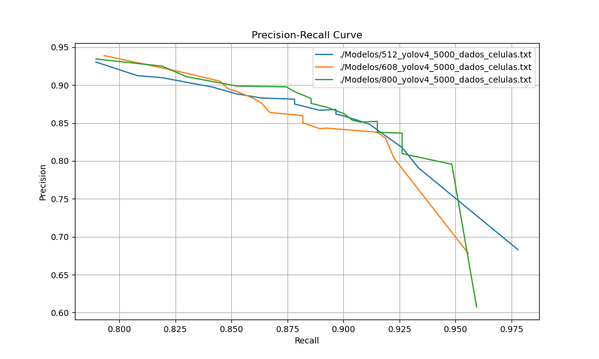
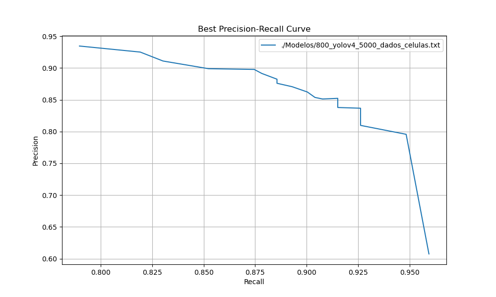

# Precision-Recall Analysis Script (Python)

Este é um script Python que processa arquivos de saída (análises de uma rede neural (Yolov4)) contendo informações de métricas de TP, FP, FN e IoU para diferentes thresholds de um algoritmo de detecção. O script calcula e plota as curvas Precision-Recall para cada arquivo e identifica o melhor threshold e arquivo com base no maior F1-Score.

## Requisitos

Certifique-se de ter o Python instalado (versão 3.x recomendada). Além disso, você precisará da biblioteca `matplotlib` para plotar os gráficos. Caso não tenha a biblioteca instalada, você pode instalá-la usando o seguinte comando:
```
pip install matplotlib
```

## Utilização

1. **Preparação dos Arquivos de Saída:**
   - Certifique-se de que você possui os arquivos de saída gerados pelo algoritmo de detecção. Cada arquivo deve conter informações sobre TP (True Positives), FP (False Positives), FN (False Negatives) e thresholds para diferentes cenários.

2. **Execução do Script:**
   - Abra o terminal ou prompt de comando.
   - Navegue até o diretório onde o script está localizado.
   - Execute o script fornecendo os nomes dos arquivos de saída como argumentos de linha de comando. Exemplo:

     ```
     python3 script.py file1.txt file2.txt file3.txt
     ```


3. **Resultados:**
   - O script irá gerar dois gráficos: 
      -  o primeiro exibirá as curvas Precision-Recall para cada arquivo. 
      
      
      -  o segundo exibirá a curva Precision-Recall para o melhor arquivo identificado.
      

   - Além disso, o script imprimirá o nome do melhor arquivo e o melhor F1-Score.
      -  (O mesmo se encontra em: `./saidas/saida_script.txt`)

## Raciocínio para Classificação do Melhor Threshold e Arquivo

O script utiliza o F1-Score para avaliar a qualidade das detecções para cada arquivo e threshold. O F1-Score é uma métrica que considera tanto a precisão quanto o recall do sistema de detecção. Para cada arquivo, o script calcula o F1-Score para cada threshold e identifica o threshold que resulta no maior F1-Score. Isso é feito para cada arquivo, permitindo que o script compare as diferentes curvas Precision-Recall.

Em diagnósticos médicos, algumas doenças são raras, enquanto outras são mais comuns. Suponha que você está desenvolvendo um sistema de diagnóstico para uma doença rara. A maioria dos casos seria da classe negativa (não doentes), e um modelo que sempre prevê "não doente" teria alta precisão, mas seria ineficaz para detectar casos reais da doença. Nesse caso, o F1-Score seria uma métrica melhor, pois levaria em consideração tanto a capacidade de identificar os casos positivos quanto a precisão em relação a eles.

O arquivo que possui o maior F1-Score é considerado o melhor arquivo, uma vez que é um indicativo de um equilíbrio sólido entre precisão e recall. A curva Precision-Recall associada ao melhor arquivo também é plotada separadamente.


### Avaliação dos Modelos

Para verificar todos os thresholds basta executar:
   ```
     python3 av_modelos_thresholds file1.txt file2.txt file3.txt
   ```
   -  Uma saída se encontra em: `./saidas/saida_av_modelos_thresholds.txt`


## Conclusão

Este script é uma ferramenta útil para analisar e comparar as métricas de detecção para diferentes arquivos e thresholds. Ele automatiza a avaliação do F1-Score e permite que você identifique rapidamente o melhor threshold e arquivo com base em um equilíbrio entre precisão e recall. Ainda há um outro script (av_modelos_thresholds.py) para a verificação de todos os Thresholds, com as métricas: Precision, Recall, F1-Score.

